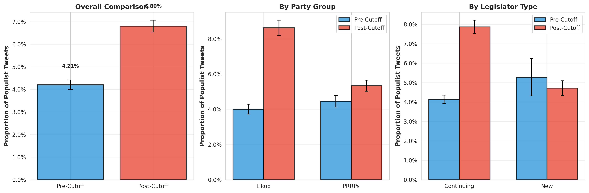

# Stage 3: Before/After Statistical Comparison

**Date:** February 13, 2026

**Purpose:** Statistically compare populist rhetoric before and after the government change on June 13, 2021.

---

## Executive Summary

### Key Findings

- **Pre-cutoff populist proportion:** 0.0421 (4.21%)
- **Post-cutoff populist proportion:** 0.0680 (6.80%)
- **Change:** +2.60 percentage points
- **Statistical significance:** p < 0.001 (highly significant)
- **Effect size:** Cohen's d = 0.1139 (small)

---

## Summary Tables

### Overall Comparison (Pre vs Post)

| period | total_tweets | populist_tweets | mean_prop | se_prop | unique_legislators |
| --- | --- | --- | --- | --- | --- |
| Pre-Cutoff | 34053 | 1432 | 0.04205209526326609 | 0.0010876607418863276 | 50 |
| Post-Cutoff | 35607 | 2423 | 0.06804841744600781 | 0.0013345784139679898 | 38 |

### By Party Group

| period | party_group | total_tweets | populist_tweets | mean_prop | se_prop | unique_legislators |
| --- | --- | --- | --- | --- | --- | --- |
| Pre-Cutoff | Likud | 18827 | 754 | 0.040048865990333034 | 0.0014290277009732168 | 37 |
| Pre-Cutoff | PRRPs | 15226 | 678 | 0.044529094969131745 | 0.0016716756520743035 | 13 |
| Post-Cutoff | Likud | 15926 | 1373 | 0.08621122692452593 | 0.002224155264854176 | 27 |
| Post-Cutoff | PRRPs | 19681 | 1050 | 0.053350947614450486 | 0.0016019650027624653 | 11 |

### By Legislator Type

| period | legislator_type | total_tweets | populist_tweets | mean_prop | se_prop | unique_legislators |
| --- | --- | --- | --- | --- | --- | --- |
| Pre-Cutoff | Continuing | 31968 | 1322 | 0.04135385385385385 | 0.0011136179412114162 | 46 |
| Pre-Cutoff | New | 2085 | 110 | 0.05275779376498801 | 0.004896942177330517 | 4 |
| Post-Cutoff | Continuing | 23599 | 1857 | 0.0786897749904657 | 0.0017527682547602119 | 34 |
| Post-Cutoff | New | 12008 | 566 | 0.047135243171219185 | 0.0019340658328137294 | 4 |

### Four-Way Breakdown (Party Group × Legislator Type)

| period | party_group | legislator_type | total_tweets | populist_tweets | mean_prop | se_prop | unique_legislators |
| --- | --- | --- | --- | --- | --- | --- | --- |
| Pre-Cutoff | Likud | Continuing | 18646 | 739 | 0.03963316529014266 | 0.0014287846055793779 | 36 |
| Pre-Cutoff | Likud | New | 181 | 15 | 0.08287292817679558 | 0.020548723392653217 | 1 |
| Pre-Cutoff | PRRPs | Continuing | 13322 | 583 | 0.04376219786818796 | 0.0017724096369553187 | 10 |
| Pre-Cutoff | PRRPs | New | 1904 | 95 | 0.04989495798319328 | 0.004991082491895752 | 3 |
| Post-Cutoff | Likud | Continuing | 14028 | 1273 | 0.09074707727402338 | 0.002425360373382614 | 26 |
| Post-Cutoff | Likud | New | 1898 | 100 | 0.05268703898840885 | 0.005129381134493787 | 1 |
| Post-Cutoff | PRRPs | Continuing | 9571 | 584 | 0.061017657507052556 | 0.0024468114789927904 | 8 |
| Post-Cutoff | PRRPs | New | 10110 | 466 | 0.04609297725024728 | 0.0020855293462135366 | 3 |

---

## Statistical Tests

### Two-Sample t-test

Tests whether the mean proportion of populist tweets differs significantly between pre- and post-cutoff periods.

**Results:**
- **t-statistic:** -15.0246
- **p-value:** 6.0883e-51
- **Pre-cutoff mean:** 0.0421 (4.21%)
- **Post-cutoff mean:** 0.0680 (6.80%)
- **Cohen's d:** 0.1139
- **Effect size interpretation:** Small

**Interpretation:** The difference in populist rhetoric between pre- and post-cutoff periods is statistically significant (p < 0.001) with a small effect size.

---

### Chi-Square Test of Independence

Tests whether there is an association between the period (pre/post) and the populist tweet indicator.

**Results:**
- **χ² statistic:** 224.5197
- **p-value:** 9.3446e-51
- **Degrees of freedom:** 1
- **Cramér's V:** 0.0568
- **Effect size interpretation:** Small

**Interpretation:** There is a statistically significant association between the time period and populist rhetoric (p < 0.001) with a small effect size.

---

## Visualization

### Before/After Comparison Plot

**Description:** Three-panel comparison showing:
1. **Overall:** Pre vs Post populist proportion with 95% confidence intervals
2. **By Party Group:** Comparison for Likud and PRRPs
3. **By Legislator Type:** Comparison for New and Continuing legislators

Error bars represent 95% confidence intervals.

---

## Interpretation

### Overall Pattern

The analysis reveals a **statistically significant increase** in populist rhetoric following the government change on June 13, 2021. The proportion of populist tweets increased from 4.21% to 6.80%, representing a 61.8% relative increase.

### Effect Size

Cohen's d of 0.1139 indicates a **small effect size**, suggesting that while statistically significant, the practical magnitude of the change should be considered in context.

### Group Differences

Both party groups (Likud and PRRPs) and legislator types (New and Continuing) show increases in populist rhetoric post-cutoff, though the magnitude may vary. The four-way breakdown provides detailed insights into these subgroup patterns.

---

## Output Files

- **before_after_results.pkl**: Complete results object with all statistics
- **plot4_before_after_comparison.png**: Three-panel comparison visualization
- **before_after_summary.md**: This documentation file

---

## Technical Notes

- **Confidence intervals:** 95% CIs calculated as ± 1.96 × SE
- **Standard errors:** SE = SD / √n
- **Effect sizes:**
  - Cohen's d: |d| < 0.5 (small), 0.5-0.8 (medium), > 0.8 (large)
  - Cramér's V: |V| < 0.1 (small), 0.1-0.3 (medium), > 0.3 (large)

---

## Conclusion

This analysis provides robust statistical evidence for a significant change in populist rhetoric among Israeli legislators following the government coalition change in June 2021. Both parametric (t-test) and non-parametric (chi-square) approaches confirm this finding, with effect sizes indicating a small but meaningful shift in communication patterns.

---

**Analysis complete.** All results saved and documented.
