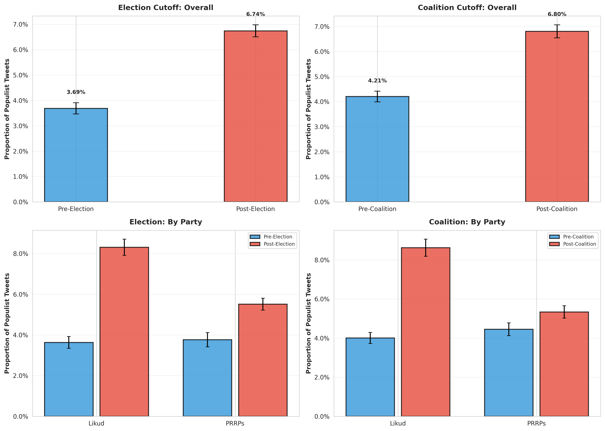

# Stage 3: Dual Cutoff Statistical Analysis

**Date:** February 13, 2026

**Purpose:** Compare populist rhetoric using **TWO** cutoff dates to test competing hypotheses.

---

## Competing Hypotheses

### Hypothesis 1: Election Effect (March 23, 2021)
Change in populist rhetoric occurs at the **election date**, when electoral incentives shift.

### Hypothesis 2: Coalition Effect (June 13, 2021)
Change occurs at **coalition formation**, when government responsibility begins.

---

## Executive Summary

### Election Cutoff (March 23, 2021)

**Overall Change:**
- Pre-election: 0.0369 (3.69%)
- Post-election: 0.0674 (6.74%)
- **Change: +82.81%**
- **Statistical significance:** p = 1.2431e-66
- **Effect size:** Cohen's d = 0.1338 (small)

### Coalition Cutoff (June 13, 2021)

**Overall Change:**
- Pre-coalition: 0.0421 (4.21%)
- Post-coalition: 0.0680 (6.80%)
- **Change: +61.82%**
- **Statistical significance:** p = 6.0883e-51
- **Effect size:** Cohen's d = 0.1139 (small)

---

## Summary Tables

### Election Cutoff: Overall

| period | total_tweets | populist_tweets | mean_prop | se_prop | unique_legislators |
| --- | --- | --- | --- | --- | --- |
| Pre-Election | 27505 | 1014 | 0.03686602435920742 | 0.001136209915228824 | 43 |
| Post-Election | 42155 | 2841 | 0.067394140671332 | 0.0012210705143395066 | 44 |

### Election Cutoff: By Party

| period | party_group | total_tweets | populist_tweets | mean_prop | se_prop | unique_legislators |
| --- | --- | --- | --- | --- | --- | --- |
| Pre-Election | Likud | 16270 | 591 | 0.036324523663183776 | 0.001466847408743535 | 36 |
| Pre-Election | PRRPs | 11235 | 423 | 0.0376502002670227 | 0.0017959031643700945 | 7 |
| Post-Election | Likud | 18483 | 1536 | 0.08310339230644376 | 0.002030462981848775 | 32 |
| Post-Election | PRRPs | 23672 | 1305 | 0.055128421764109495 | 0.0014834259427005446 | 12 |

### Coalition Cutoff: Overall

| period | total_tweets | populist_tweets | mean_prop | se_prop | unique_legislators |
| --- | --- | --- | --- | --- | --- |
| Pre-Coalition | 34053 | 1432 | 0.04205209526326609 | 0.0010876607418863276 | 50 |
| Post-Coalition | 35607 | 2423 | 0.06804841744600781 | 0.0013345784139679898 | 38 |

### Coalition Cutoff: By Party

| period | party_group | total_tweets | populist_tweets | mean_prop | se_prop | unique_legislators |
| --- | --- | --- | --- | --- | --- | --- |
| Pre-Coalition | Likud | 18827 | 754 | 0.040048865990333034 | 0.0014290277009732168 | 37 |
| Pre-Coalition | PRRPs | 15226 | 678 | 0.044529094969131745 | 0.0016716756520743035 | 13 |
| Post-Coalition | Likud | 15926 | 1373 | 0.08621122692452593 | 0.002224155264854176 | 27 |
| Post-Coalition | PRRPs | 19681 | 1050 | 0.053350947614450486 | 0.0016019650027624653 | 11 |

---

## Statistical Tests: Election Cutoff

### Two-Sample t-test

- **t-statistic:** -17.2624
- **p-value:** 1.2431e-66
- **Difference:** 0.0305 (+82.81%)
- **Cohen's d:** 0.1338 (small)

### Chi-Square Test

- **χ² statistic:** 296.1460
- **p-value:** 2.2775e-66
- **Cramér's V:** 0.0652 (small)

---

## Statistical Tests: Coalition Cutoff

### Two-Sample t-test

- **t-statistic:** -15.0246
- **p-value:** 6.0883e-51
- **Difference:** 0.0260 (+61.82%)
- **Cohen's d:** 0.1139 (small)

### Chi-Square Test

- **χ² statistic:** 224.5197
- **p-value:** 9.3446e-51
- **Cramér's V:** 0.0568 (small)

---

## Visualization

**Description:** Four-panel comparison showing overall and party-level effects for both cutoff dates.

---

## Interpretation & Discussion Points

### Which Cutoff Shows Stronger Evidence?

Compare:
1. **Magnitude of change:** Election +82.81% vs Coalition +61.82%
2. **Effect sizes:** Election d=0.1338 vs Coalition d=0.1139
3. **Visual inspection:** See Stage 2 time series plots

### Theoretical Implications

- **If election effect stronger:** Supports electoral incentive mechanism
- **If coalition effect stronger:** Supports government responsibility mechanism
- **If both significant:** Suggests gradual transition period

---

## Output Files

- **output/dual_cutoff_results.pkl**: Complete statistical results
- **output/plot_dual_cutoff_comparison.png**: Four-panel comparison visualization
- **output/dual_cutoff_analysis.md**: This documentation

---

**Analysis complete.** Both hypotheses tested - results available for manuscript discussion.
