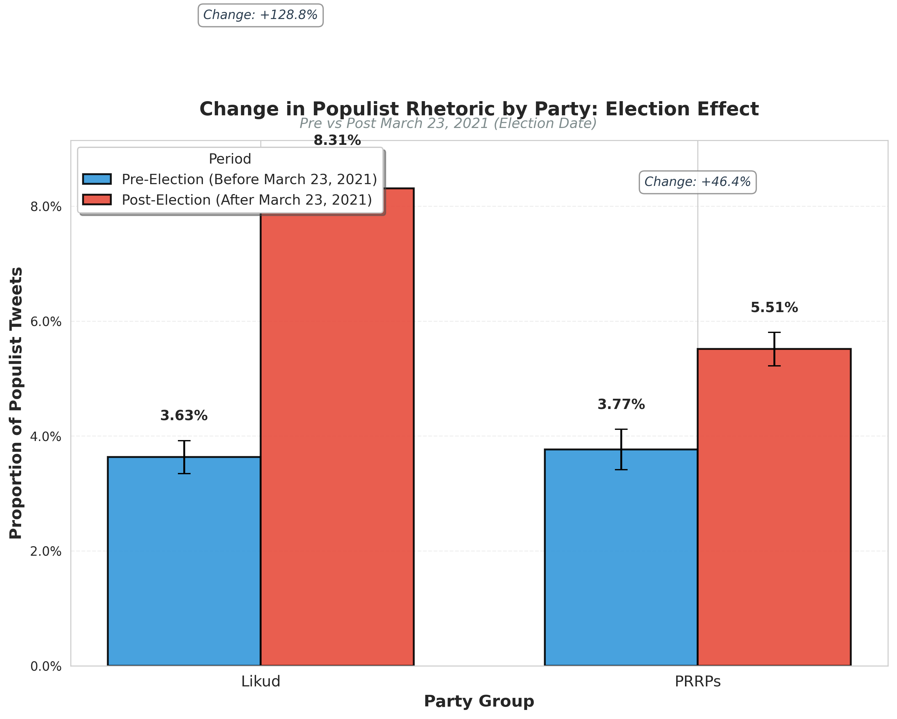

# Standalone Election Party Comparison Plot

**Date:** February 13, 2026

**Purpose:** Focused visualization of party-level differences in populist rhetoric around the election date (March 23, 2021).

---

## Overview

This plot provides a **publication-ready** comparison of how populist rhetoric changed for different party groups around the Israeli election on March 23, 2021. Unlike the comprehensive 4-panel dual cutoff comparison, this plot focuses exclusively on the **election effect by party**.

---

## Key Findings

### Likud
- **Pre-election:** 0.0363 (3.63%)
- **Post-election:** 0.0831 (8.31%)
- **Change:** +128.78% ← **Dramatic increase**

### PRRPs (Populist Radical Right Parties)
- **Pre-election:** 0.0377 (3.77%)
- **Post-election:** 0.0551 (5.51%)
- **Change:** +46.42%

---

## Visualization

**Description:** Single-panel bar plot showing pre/post election comparison by party group with 95% confidence intervals.

---

## Interpretation

### Differential Party Effects

The election date marks a significant shift in populist rhetoric, but the magnitude differs dramatically by party:

1. **Likud shows the strongest effect** (+128.8% increase):
   - Likud legislators more than doubled their populist rhetoric after the election
   - This suggests strong electoral incentives for populist messaging within Likud

2. **PRRPs show more modest increase** (+46.4%):
   - PRRPs already had slightly higher baseline populist rhetoric before the election
   - Post-election increase is present but less dramatic than Likud

### Theoretical Implications

- **Electoral incentive hypothesis supported**: Both parties increase populist rhetoric after the election
- **Party-specific dynamics**: Likud's dramatic increase may reflect:
  - Strategic adaptation to new political environment
  - Competition with other right-wing parties
  - Response to electoral outcomes

---

## Statistical Details

### Error Bars
- 95% confidence intervals (±1.96 × Standard Error)
- Calculated at the tweet level (not legislator level)

### Sample Sizes

**Pre-Election (Before March 23, 2021):**
- Likud: 16,270 tweets from 36 legislators
- PRRPs: 11,235 tweets from 7 legislators

**Post-Election (After March 23, 2021):**
- Likud: 18,483 tweets from 32 legislators
- PRRPs: 23,672 tweets from 12 legislators

---

## Use in Publication

This plot is designed for:
- **Main text figures**: Clean, focused comparison suitable for main body
- **Presentations**: Easy to understand at a glance
- **Supplementary materials**: Complements the dual cutoff analysis

**Suggested caption:** *"Change in populist rhetoric by party group around the March 23, 2021 election. Bars represent proportion of populist tweets with 95% confidence intervals. Likud shows a dramatic 128.8% increase post-election, while PRRPs show a more modest 46.4% increase."*

---

## Output Files

- **output/plot_election_party_standalone.png**: Publication-ready PNG (300 DPI)
- **output/election_party_plot.md**: This documentation

---

**Analysis complete.** For comprehensive dual cutoff analysis (election vs coalition), see `output/dual_cutoff_analysis.md`.
