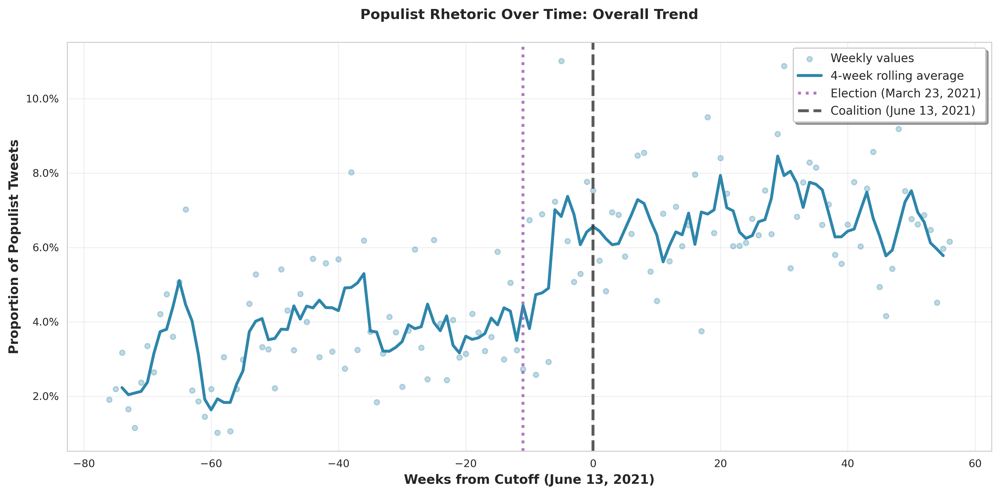
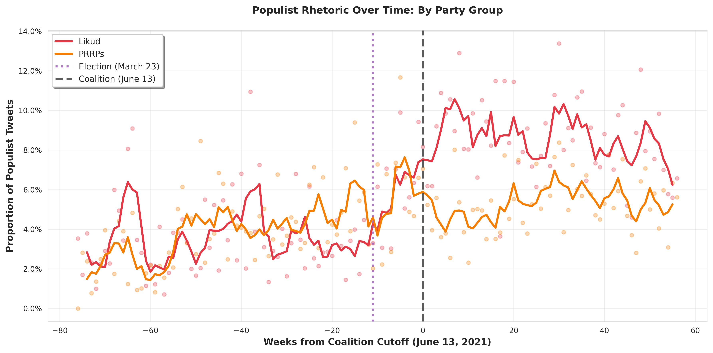

# Stage 2: Time Series Visualizations

**Date:** February 13, 2026

**Purpose:** Visualize trends in populist rhetoric over time, showing both critical dates.

---

## Overview

This analysis examines temporal trends in populist tweets from Israeli legislators, showing **two critical dates**:
- **March 23, 2021**: Election date (dotted purple line)
- **June 13, 2021**: Coalition formation (dashed black line)

Visual inspection helps determine which event marks the true discontinuity in populist rhetoric.

### Key Findings (Coalition Cutoff)

- **Pre-coalition mean:** 3.92% populist tweets
- **Post-coalition mean:** 6.75% populist tweets
- **Change:** +71.9% increase

---

## Visualizations

### Plot 1: Overall Trend

**Description:** Overall proportion of populist tweets over time with a 4-week rolling average.
- **Purple dotted line**: Election (March 23, 2021)
- **Black dashed line**: Coalition formation (June 13, 2021)

**Key observations:**
- Visual inspection reveals timing of the change
- Smoothed trend line shows the general trajectory
- Both critical dates marked for comparison

---

### Plot 2: By Party Group (Likud vs PRRPs)

**Description:** Compares populist rhetoric trends between Likud and PRRPs (Populist Radical Right Parties).

**Key observations:**
- Differential timing of changes between party groups possible
- Both critical dates shown for each group
- 4-week rolling averages smooth out weekly volatility

---

## Data Summary

- **Total observations:** 69,660
- **Time span:** 133 weeks
- **Election week:** -11 (March 23, 2021)
- **Coalition week:** 0 (June 13, 2021)
- **Smoothing method:** 4-week rolling average (centered)

---

## Technical Details

**Critical dates:**
- **Election**: March 23, 2021 (week -11)
- **Coalition**: June 13, 2021 (week 0, reference point)

**Visualization settings:**
- Resolution: 300 DPI
- Format: PNG
- Smoothing: 4-week centered rolling average
- Two vertical lines mark both critical dates

**Data aggregation:**
- Weekly aggregation by `week_from_cutoff` (relative to coalition date)
- Proportion calculated as: populist_tweets / total_tweets

---

## Output Files

- **plot1_overall_trend.png**: Overall populist proportion trend
- **plot2_by_party.png**: Trend comparison by party group

---

## Next Steps

Proceed to Stage 3: Statistical tests for **both** cutoff dates to determine which hypothesis is supported.
