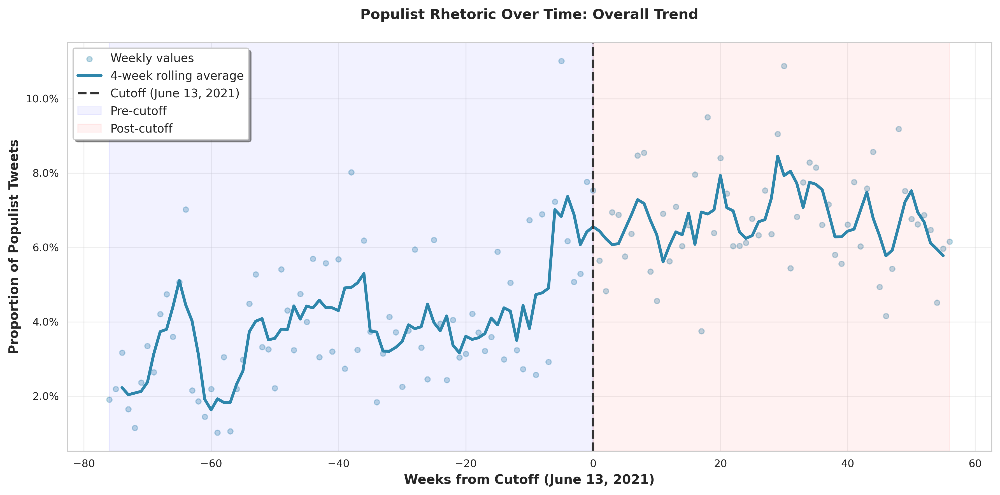
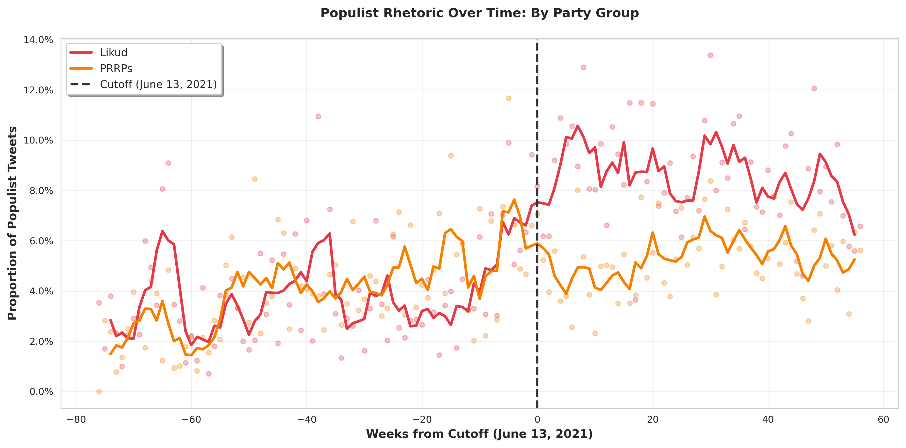
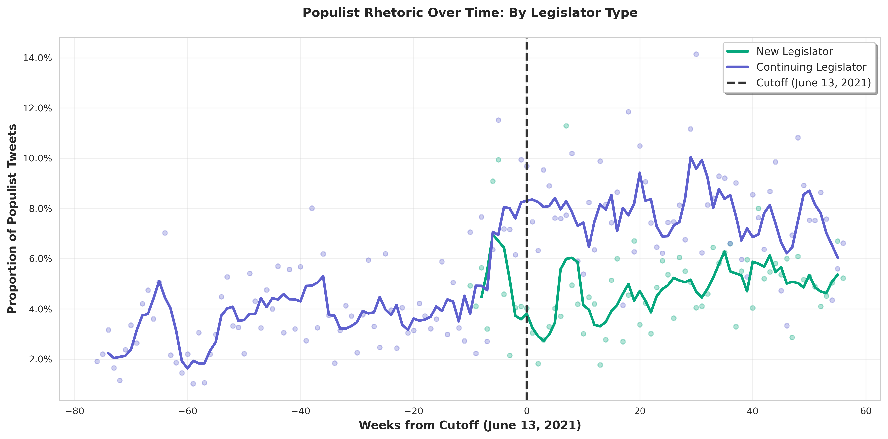

# Stage 2: Time Series Visualizations

**Date:** February 13, 2026

**Purpose:** Visualize trends in populist rhetoric over time around the government coalition change.

---

## Overview

This analysis examines temporal trends in populist tweets from Israeli legislators, focusing on the period before and after the government change on June 13, 2021.

### Key Findings

- **Pre-cutoff mean:** 3.92% populist tweets
- **Post-cutoff mean:** 6.75% populist tweets
- **Change:** +71.9% increase

---

## Visualizations

### Plot 1: Overall Trend

**Description:** Shows the overall proportion of populist tweets over time with a 4-week rolling average. The vertical dashed line marks June 13, 2021 (government change).

**Key observations:**
- Clear visual distinction between pre- and post-cutoff periods
- Smoothed trend line shows the general trajectory
- Weekly variation captured in scatter points

---

### Plot 2: By Party Group (Likud vs PRRPs)

**Description:** Compares populist rhetoric trends between Likud (the dominant party) and PRRPs (Populist Radical Right Parties).

**Key observations:**
- Separate trends for Likud and PRRPs coalition members
- Both groups show temporal patterns around the cutoff
- 4-week rolling averages smooth out weekly volatility

---

### Plot 3: By Legislator Type (New vs Continuing)

**Description:** Compares trends between new legislators (elected in 2021) and continuing legislators.

**Key observations:**
- Differential trends between new and continuing legislators
- New legislators may show different rhetorical patterns
- Both groups' trends are smoothed with 4-week rolling averages

---

## Data Summary

- **Total observations:** 69,660
- **Time span:** 133 weeks
- **Weeks before cutoff:** 76
- **Weeks after cutoff:** 57
- **Smoothing method:** 4-week rolling average (centered)

---

## Technical Details

**Visualization settings:**
- Resolution: 300 DPI
- Format: PNG
- Smoothing: 4-week centered rolling average
- Cutoff marked at week 0 (June 13, 2021)

**Data aggregation:**
- Weekly aggregation by `week_from_cutoff`
- Proportion calculated as: populist_tweets / total_tweets
- Separate aggregations for overall, by party_group, and by legislator type

---

## Output Files

- **plot1_overall_trend.png**: Overall populist proportion trend
- **plot2_by_party.png**: Trend comparison by party group
- **plot3_by_new24.png**: Trend comparison by legislator type

---

## Next Steps

Proceed to Stage 3: Before/After Statistical Comparison
